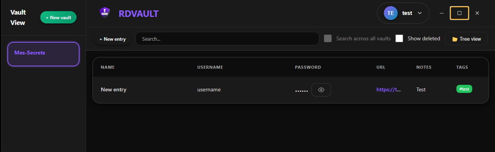
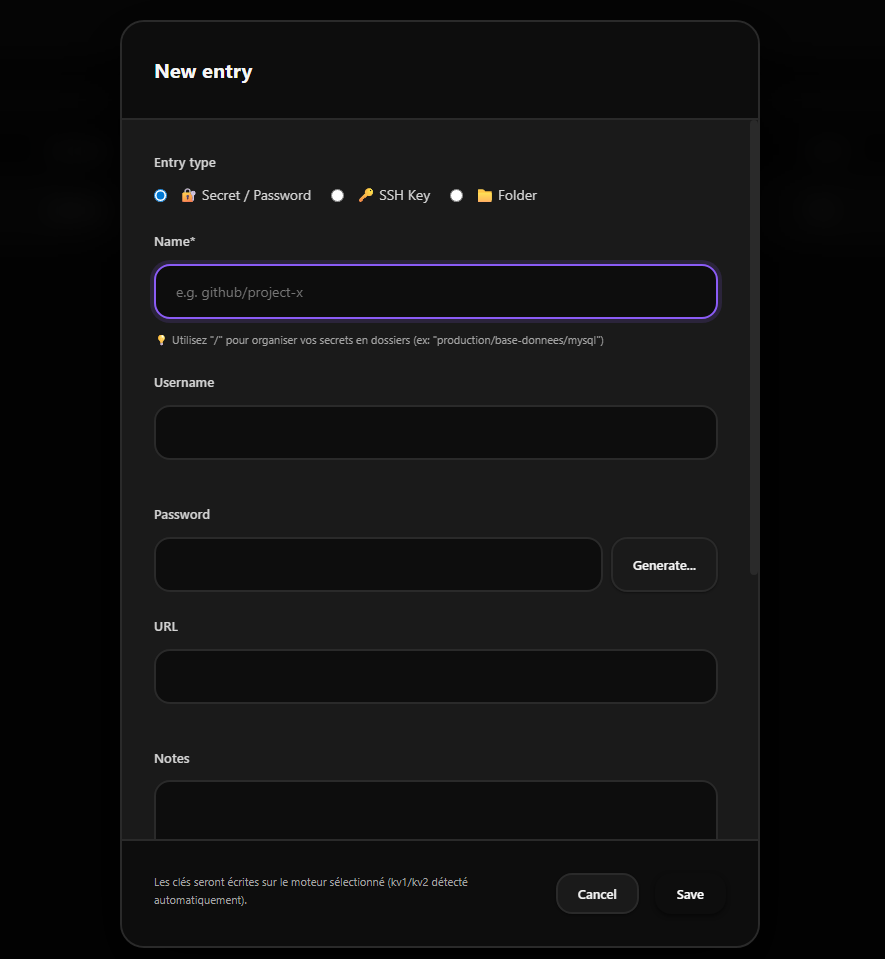
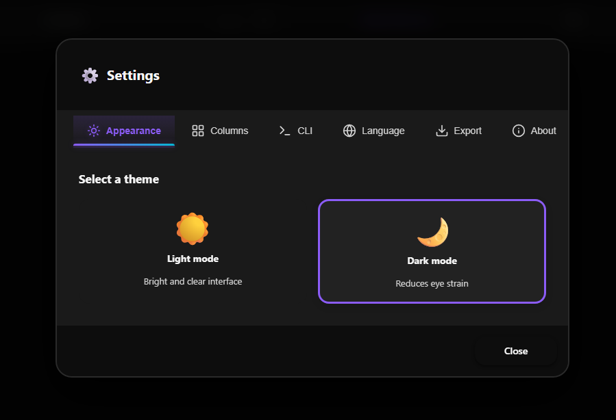

# RDVAULT

A modern desktop client for [HashiCorp Vault](https://www.vaultproject.io/) with a built-in local mode, Chrome autofill extension, and CLI tool.

Built with Electron + React. **8 security audits passed (91 issues found, 68 fixed).**


---

## Quick Start

**Download the installer** from the [Releases page](../../releases/latest) and run it. Choose between **Enterprise** (Vault server) or **Local** (offline, encrypted database) mode.

> **Note:** The installer is not code-signed yet. Windows Defender SmartScreen may show a warning. Click **More info** → **Run anyway** to proceed.

To build the installer yourself, see [Installation from source](#from-source) below.

---

## Features

### Two modes

| | Enterprise | Local |
|---|---|---|
| Backend | HashiCorp Vault server | Local encrypted SQLite database |
| Auth | LDAP (Active Directory) | Local accounts |
| Network | Requires Vault server | Fully offline |
| Use case | Teams, organizations | Personal, air-gapped |

Mode is selected at install time or via `APP_MODE` in `config.cfg`.

### Secret Management
- KV v2 engine support (versioning, soft-delete, restore)
- KV v1 compatibility
- Folder hierarchy with drag-and-drop
- Secrets: username, password, URL, notes, tags, custom fields, attachments
- SSH keys storage
- TOTP (2FA) generation and management
- Password generator with entropy indicator
- Version history with restore
- Bulk select, migrate, copy, move between vaults
- Self-service: users create and manage personal vaults under `users/<username>/`

### Security
- AES-256-GCM encryption (local mode) with PBKDF2 key derivation (210k iterations, SHA-512)
- Vault token in memory only, never persisted to disk
- Derived encryption key stored instead of raw password
- Secure clipboard with auto-clear (12s)
- Dual session timeout: 15min inactivity + 3h locked screen
- Brute force protection (client + server-side with rate limiting)
- Input validation, XSS prevention, path traversal protection
- Context isolation, sandbox, CSP headers, webviewTag disabled (Electron)
- All IPC handlers validated with sender check
- Timing-safe token comparison everywhere (HMAC-based)
- Security response headers on all HTTP servers (nosniff, no-store, DENY)
- 8 security audits: 91 issues identified, 68 fixed, 23 accepted (architectural limitations)

### Chrome Extension
- **Autofill** credentials on any HTTPS web page
- **Two versions included**: simple (direct Vault connection) and enriched (syncs with desktop app)
- Syncs with the desktop app via an encrypted local file (Electron safeStorage / DPAPI)
- TOTP code relay from desktop to extension
- Manifest V3 compliant
- Secure subdomain matching (prevents credential theft via subdomain takeover)
- CORS restricted to `chrome-extension://` origins with strict regex validation
- Private Network Access header support for Chrome 117+

#### Installation
1. Open `chrome://extensions` in Chrome
2. Enable **Developer mode**
3. Click **Load unpacked** and select the `chrome-extension/vault-autofill-extension/` folder
4. The RDVAULT icon appears in the toolbar
5. The extension automatically detects the desktop app when it's running

#### How it works
```
Web page → Content script detects login form
                    ↓
         Background service worker
                    ↓
     HTTP request to desktop sync server (port 45678)
                    ↓
     Encrypted sync file ← Desktop app (React)
                    ↓
     Credentials matched by URL → autofilled
```

The extension never stores passwords — it reads them from the desktop app's encrypted sync file on each request.

### CLI (`mvault`)
- `mvault engines` — list available vaults
- `mvault ls <engine>` — list secrets in a vault
- `mvault get <engine>/<path> -k <field>` — retrieve a specific field (raw text on stdout)
- `mvault status` — check connection to desktop app
- `mvault rules` — show auto-approve rules (read-only)
- Designed for **AI agents** (Claude Code, Copilot) and shell scripts
- Confirmation popup per access (configurable auto-approve per vault in Settings > CLI)
- Burst detection: forces confirmation after 15 rapid auto-approved accesses in 60s
- Hashed audit log for traceability without exposing secret names
- Token revoked on logout

#### Example: SSH with mvault
```bash
# Retrieve password from vault and connect via SSH
plink -batch -hostkey "SHA256:..." -ssh \
  -pw "$(mvault get engine/server -k password)" \
  admin@10.0.0.5 "hostname && uptime"
```

See [`cli/README.md`](cli/README.md) for full documentation including host key setup.

### Remote Access
- **RBI** (Remote Browser Isolation): open URLs in secure sandboxed Chromium with auto-injected credentials
- SSH launcher (PuTTY), RDP launcher (mstsc), SFTP launcher (FileZilla / WinSCP)
- RBI session sharing via Vault wrapping tokens (enterprise mode)
- URL protocol routing: SSH, RDP, SFTP, FTP, VNC, UNC paths, HTTP/HTTPS

### Admin Panel
- Policy builder (HCL) with live preview
- Engine management (create, delete, configure)
- AD group ↔ policy mapping
- Audit log viewer (local files or remote via SSH)
- Moderator role support (per-engine management delegation)

### i18n
12 languages: English (default), French, Spanish, German, Russian, Chinese, Portuguese, Italian, Japanese, Korean, Arabic, Turkish.

Configurable via Settings UI or `LANG` in `config.cfg` for mass deployment.

### Import / Export
- Export vaults to **CSV** or **XML**
- Import from CSV or XML with duplicate handling (skip or overwrite)
- CSV formula injection protection on export
- Control character sanitization on import
- Multi-line quoted field support (RFC 4180)

---

## Screenshots

| Secrets browser | Edit secret | Settings |
|---|---|---|
|  |  |  |

---

## Installation

### From installer

Download `RDVAULT Setup x.x.x.exe` from [Releases](../../releases/latest). The installer lets you choose between **Enterprise** and **Local** mode.

Silent install:
```bash
"RDVAULT Setup 1.4.0.exe" /S /MODE=local
# or with config file:
"RDVAULT Setup 1.4.0.exe" /S /CONFIG=C:\path\to\config.cfg
```

### From source

```bash
git clone https://github.com/Blazefive/RDVAULT.git
cd RDVAULT
npm install
```

**Development:**
```bash
npm start          # React dev server (port 3000)
npm run electron   # Electron app (in another terminal)
```

**Build installer:**
```bash
npm run dist       # Build React + package Windows installer → dist/
```

---

## Configuration

### config.cfg

```ini
# Enterprise mode: Vault server URL
VAULT_URL=https://vault.example.com:8200

# LDAP auth path in Vault
LDAP_AUTH_PATH=auth/ldap

# Trusted SSL domains (comma-separated, for self-signed certs)
TRUSTED_DOMAINS=vault.example.com,localhost,127.0.0.1

# RBI proxy URL (optional, for secure session sharing)
RBI_PROXY_URL=

# App mode: enterprise or local
APP_MODE=enterprise

# Default language (en, fr, es, de, ru, zh, pt, it, ja, ko, ar, tr)
LANG=en
```

Place this file next to the executable for deployment, or in `%APPDATA%/rdvault/` for per-user config.

---

## Server Deployment (Enterprise Mode)

See [`DEPLOYMENT.md`](DEPLOYMENT.md) for a complete guide to set up the Vault server from scratch, including:

- Vault installation and configuration (Raft storage, TLS)
- LDAP authentication setup
- 5 policy templates (admin, moderator, RW, RO, self-service)
- AD group ↔ policy mapping with step-by-step procedures
- RBI proxy setup
- Firewall rules and backup procedures

---

## Architecture

```
src/
  services/vaultApi.js          — Vault HTTP API abstraction (17 methods)
  hooks/                        — 16 custom hooks (auth, secrets, engines, TOTP, tags,
                                  clipboard, selection, columns, treeView, config,
                                  contextMenus, migration, dragDrop, sync, toast)
  components/                   — UI components (LoginForm, Sidebar, Toolbar,
                                  SecretsTable, SecretContextMenu, ModalOrchestrator)
  utils/                        — Security utilities, URL handler, tag manager
  locales/                      — 12 language files
  App.jsx                       — Orchestrator (~1000 lines)

electron/
  main.js                       — Window management, IPC, sync server
  preload.js                    — Context bridge (8 API namespaces)
  secureSession.js              — RBI: Puppeteer credential injection
  cliServer.js                  — CLI HTTP server with burst detection
  localVault/                   — Local mode (SQLite + AES-256-GCM)

cli/mvault.js                   — CLI tool
chrome-extension/               — Chrome autofill extension (2 versions)
```

### How it works

**Enterprise mode:**
```
React → axios → HashiCorp Vault API (HTTPS)
```

**Local mode:**
```
React → axios → localVaultServer.js (localhost) → SQLite (AES-256-GCM encrypted)
```

The local server implements the same REST API as Vault, so React works unchanged in both modes.

**CLI flow:**
```
mvault → HTTP → cliServer.js → IPC → React → Vault API → stdout
```

**Chrome extension flow:**
```
Extension → HTTP (port 45678) → sync server → encrypted file ← React
```

---

## Security Model

| Layer | Protection |
|-------|-----------|
| Electron | contextIsolation, sandbox, no nodeIntegration, webviewTag disabled, CSP headers, IPC sender validation on all handlers |
| Network | TLS 1.2+, certificate validation by domain whitelist, rejects revoked/invalid/CN-mismatch certs |
| Authentication | LDAP (enterprise) / bcrypt 12 rounds (local), timing-safe login, brute force protection |
| Secrets at rest | Vault (enterprise) / AES-256-GCM per-field with PBKDF2-derived key at 210k iterations (local) |
| Secrets in memory | Derived key in Map (never raw password), cleared on logout, all localStorage/sessionStorage cleaned |
| Session | 15min inactivity timeout + 3h lock-screen timeout, CLI token revoked on logout |
| Clipboard | Auto-clear after 12s, Windows clipboard history wipe |
| CLI | Per-request confirmation popup, burst detection (15/min), hashed audit log with rotation |
| HTTP servers | X-Content-Type-Options: nosniff, Cache-Control: no-store, X-Frame-Options: DENY |
| Export | File permissions 0o600, CSV formula injection protection, import field sanitization |
| Chrome extension | Strict origin validation, secure subdomain matching, encrypted sync file |

---

## Tech Stack

- **Frontend**: React 18 (functional components, custom hooks)
- **Desktop**: Electron 38 (context isolation, sandbox)
- **Database** (local mode): better-sqlite3
- **Crypto**: Node.js crypto (AES-256-GCM, PBKDF2, HMAC-SHA256)
- **HTTP**: Axios
- **SSH**: ssh2
- **Browser automation**: Puppeteer-core
- **Build**: react-scripts + electron-builder (NSIS)
- **CI/CD**: GitHub Actions (build + security scan)
- **i18n**: Custom React context + JSON locale files

---

## Contributing

1. Fork the repository
2. Create a feature branch
3. Make your changes
4. Test with `npm start` + `npm run electron`
5. Submit a pull request

---

## License

MIT

---

## Author

**Blazefive**
